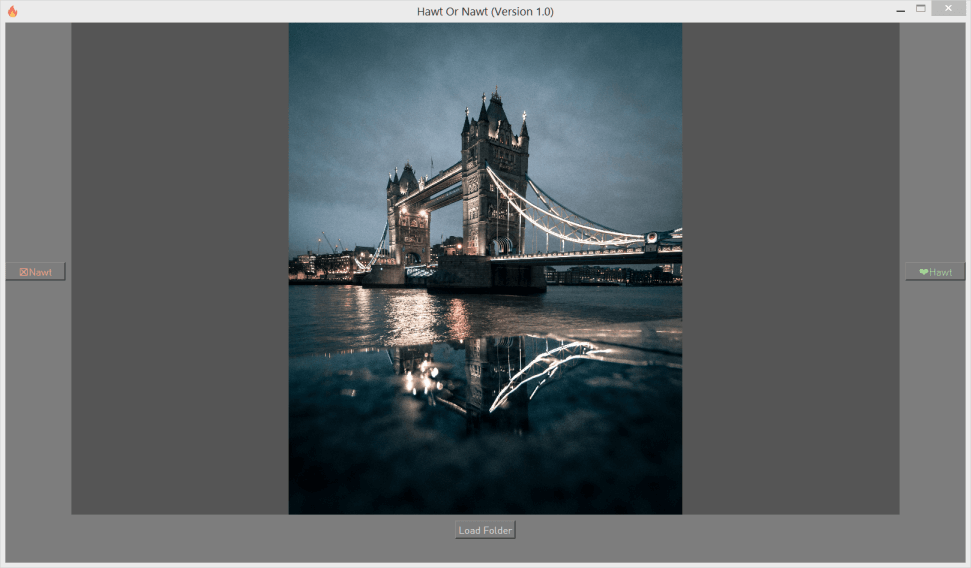

# Hot or Not
Enables you to quickly filter through images on your PC using arrow keys (similiar to Tinder).

1. Click on Load Folder to choose your folder with images.
2. Press **left arrow** for "Nawt" which will move the image into the directory "{yourdirectory}/nawt".
3. Press **right arrow** for "Hawt" which will move the image into the directory "{yourdirectory}/hawt".
4. Press **down arrow** for undo which will show you the previously hawt/nawt image and moves it back to {yourdirectory}.
5. At the end of a folder it will ask you to delete the nawt-folder and it will open your directory.

Icon made by <a href="https://www.flaticon.com/authors/vectors-market" title="Vectors Market">Vectors Market</a> from <a href="https://www.flaticon.com/" title="Flaticon">www.flaticon.com</a> is licensed by <a href="http://creativecommons.org/licenses/by/3.0/" title="Creative Commons BY 3.0" target="_blank">CC 3.0 BY</a>
